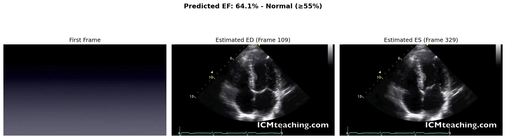
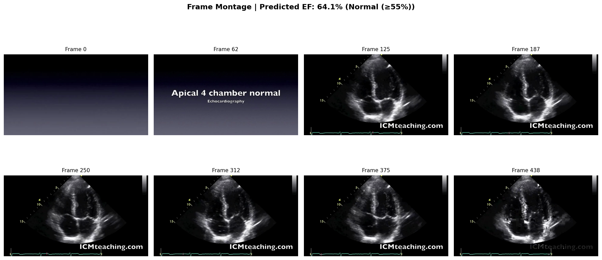

# Echocardiography EF Prediction

A command-line tool for predicting **Left Ventricular Ejection Fraction (EF)** from echocardiogram videos using the pretrained [EchoNet-Dynamic](https://github.com/echonet/dynamic) model.

## Requirements Checklist

| Requirement           | Status | Notes                            |
| --------------------- | ------ | -------------------------------- |
| **1. Model Setup**    | ✅     | R(2+1)D-18 pretrained weights    |
| Model loads once      | ✅     | Lazy loading in `model_utils.py` |
| `requirements.txt`    | ✅     | All dependencies included        |
| **2. Input Handling** | ✅     |                                  |
| Accept AVI/MP4        | ✅     | Both formats supported           |
| Validate file type    | ✅     | Clear error messages             |
| Validate size ≤50MB   | ✅     | Enforced                         |
| **3. EF Prediction**  | ✅     |                                  |
| Predicted EF (%)      | ✅     | JSON output                      |
| Latency metrics       | ✅     | Preprocessing + inference time   |
| **4. Visualization**  | ✅     |                                  |
| Side-by-side frames   | ✅     | `out/*_visualization.png`        |
| ED/ES frames shown    | ✅     | Estimated frames highlighted     |
| **6. Deliverables**   | ✅     |                                  |
| `ef_inference.py` CLI | ✅     | Full CLI with argparse           |
| JSON output           | ✅     | Complete structure               |
| README.md             | ✅     | This document                    |

---

## Model Choice: EchoNet-Dynamic

We use the **R(2+1)D-18** model from Stanford's EchoNet-Dynamic project:

- **Pretrained weights**: Official release from GitHub
- **Proven accuracy**: MAE of 4.1% on EchoNet dataset
- **Published research**: [Nature, March 2020](https://doi.org/10.1038/s41586-020-2145-8)

## Why EF Prediction is Challenging

### Clinical Challenges

- **Beat-to-beat variation**: EF can vary 5-10% between cardiac cycles
- **Image quality**: Depends on patient body habitus and probe positioning
- **View standardization**: Requires apical 4-chamber (A4C) view
- **Population bias**: Model trained on adult Stanford patients

### Technical Challenges

- **Temporal modeling**: Must capture cardiac motion across 32 frames
- **Small structures**: Left ventricle boundaries are subtle
- **Preprocessing**: Requires consistent frame sampling and normalization

---

## Installation

### 1. Clone and install dependencies

```bash
git clone <repo-url>
cd Echocardiography_Ejection_Fraction_Prediction_TEST_C
pip install -r requirements.txt
```

### 2. Download pretrained weights

```bash
python ef_inference.py --download-weights
```

Or manually:

```bash
mkdir -p models
wget -O models/r2plus1d_18_32_2_pretrained.pt \
    https://github.com/echonet/dynamic/releases/download/v1.0.0/r2plus1d_18_32_2_pretrained.pt
```

---

## Usage

### Basic EF Prediction

```bash
python ef_inference.py --video sample.avi --out results.json
```

### With Visualization

```bash
python ef_inference.py --video sample.avi --out results.json --visualize
```

### Test with Sample Video

Download a sample A4C echocardiogram video for testing:

```bash
# Option 1: Download sample A4C normal echo (tested, EF ~64%)
yt-dlp -f "best[ext=mp4][height<=480]" -o "a4c_normal.mp4" "https://www.youtube.com/watch?v=lpcJdTwmLRw"

# Run inference
python ef_inference.py --video a4c_normal.mp4 --out results.json --visualize
```

Or use any echocardiogram video in AVI/MP4 format (A4C view recommended).

### CLI Options

| Argument             | Description                              |
| -------------------- | ---------------------------------------- |
| `--video`            | Path to input video (AVI or MP4)         |
| `--out`              | Output JSON file (default: results.json) |
| `--visualize`        | Generate visualizations in `out/`        |
| `--download-weights` | Download pretrained weights              |

---

## Output Format

### JSON Output

```json
{
  "ejection_fraction": 64.09,
  "ef_category": "Normal (≥55%)",
  "timing": {
    "preprocessing_time_ms": 636.23,
    "inference_time_ms": 620.78
  },
  "video_metadata": {
    "frame_count": 439,
    "fps": 25.0,
    "duration_sec": 17.56
  }
}
```

### Visualizations

- `out/<video>_visualization.png` - Key frames with EF prediction
- `out/<video>_montage.png` - Frame montage across the video

### Sample Output

**Test Video**: [Apical 4 Chamber normal](https://www.youtube.com/watch?v=lpcJdTwmLRw) (17.5s, 439 frames)  
**Predicted EF**: 64.1% (Normal)

#### Visualization Output



#### Frame Montage



---

## EF Clinical Categories

| EF Range | Category           |
| -------- | ------------------ |
| ≥55%     | Normal             |
| 40-54%   | Mildly Reduced     |
| 30-39%   | Moderately Reduced |
| <30%     | Severely Reduced   |

---

## Input Requirements

- **Format**: AVI or MP4
- **Max Size**: 50 MB
- **View**: Apical 4-chamber (A4C) required
- **Quality**: Clear LV visualization

---

## Project Structure

```
├── ef_inference.py          # Main CLI script
├── models/                  # Pretrained weights (download required)
│   └── r2plus1d_18_32_2_pretrained.pt (239MB)
├── utils/
│   ├── __init__.py
│   ├── video_utils.py       # Video loading/validation
│   └── model_utils.py       # Model loading/inference
├── out/                     # Visualization outputs
├── requirements.txt
└── README.md
```

---

## References

- [EchoNet-Dynamic GitHub](https://github.com/echonet/dynamic)
- [Nature Paper](https://doi.org/10.1038/s41586-020-2145-8)
- [EchoNet Dataset](https://echonet.github.io/dynamic/)

## License

MIT License (following EchoNet-Dynamic)
