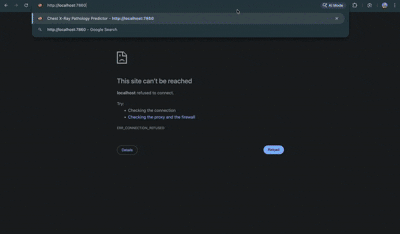

# 🏥 Chest X-Ray Pathology Predictor

A Flask + Gradio web application for detecting pathologies in chest X-ray images using deep learning. Built with torchxrayvision DenseNet-121 model with Grad-CAM explainability.

---

## 🎬 Demo



---

## 🎯 Features

✅ **Core Requirements (per taskA.md):**

- Flask backend with Gradio UI and JSON REST API
- Pretrained DenseNet-121 model (18 pathologies)
- JPG/PNG/DICOM file support with DICOM de-identification
- File validation (≤10MB, type checking)
- Grayscale conversion & normalization
- Grad-CAM visual explainability
- Performance metrics (preprocessing, inference, Grad-CAM times)

---

## 📁 Project Structure

```
x_ray_pathology_prediction/
├── app.py                  # Main Flask + Gradio application
├── requirements.txt        # Python dependencies
├── .gitignore              # Git ignore patterns
├── taskA.md                # Task specification
├── README.md               # This file
├── utils/
│   ├── __init__.py         # Package init
│   ├── preprocessing.py    # Image & DICOM processing
│   └── explainability.py   # Grad-CAM implementation
└── uploads/                # Runtime upload storage (auto-created, empty by default)
```

> **Note:** The `uploads/` folder is intentionally empty. It's a runtime directory where uploaded images are temporarily stored during app usage. Test files are not committed to git.

---

## 🚀 Quick Start

### Installation

```bash
# Enter the project directory
cd x_ray_pathology_prediction

# Create and activate virtual environment
python3 -m venv venv
source venv/bin/activate  # On Windows: venv\Scripts\activate

# Install dependencies
pip install -r requirements.txt

# Run the application
python app.py
```

### Access Points

| Service          | URL                               |
| ---------------- | --------------------------------- |
| **Gradio UI**    | http://localhost:7860             |
| **REST API**     | http://localhost:5000/api/predict |
| **Health Check** | http://localhost:5000/health      |

---

## 🛠️ Creating From Scratch

If you need to recreate this project:

### Step 1: Create Project Structure

```bash
mkdir x_ray_pathology_prediction
cd x_ray_pathology_prediction
mkdir utils uploads
touch utils/__init__.py
```

### Step 2: Create requirements.txt

```txt
Flask==3.0.0
Flask-CORS==4.0.0
werkzeug==3.0.1
gradio
torch>=2.2.0
torchvision>=0.17.0
torchxrayvision==1.2.1
Pillow==10.1.0
pydicom==2.4.4
grad-cam
numpy==1.26.2
pandas==2.1.4
matplotlib==3.8.2
```

### Step 3: Create Core Files

1. **`utils/preprocessing.py`** - Image preprocessing

   - `XRayPreprocessor` class for validation, loading, and normalization
   - DICOM de-identification (strips patient metadata)

2. **`utils/explainability.py`** - Grad-CAM visualization

   - `XRayExplainer` class for generating attention heatmaps

3. **`app.py`** - Main application
   - Load torchxrayvision model at startup
   - Gradio UI for browser access (port 7860)
   - Flask REST API (port 5000)

### Step 4: Run

```bash
python3 -m venv venv
source venv/bin/activate
pip install -r requirements.txt
python app.py
```

---

## 📊 Model Information

| Property      | Value                                           |
| ------------- | ----------------------------------------------- |
| Architecture  | DenseNet-121                                    |
| Model Name    | `densenet121-res224-all`                        |
| Input Size    | 224×224 grayscale                               |
| Training Data | NIH ChestX-ray14, CheXpert, MIMIC-CXR, PadChest |

**18 Pathologies Detected:**
Atelectasis, Consolidation, Infiltration, Pneumothorax, Edema, Emphysema, Fibrosis, Effusion, Pneumonia, Pleural Thickening, Cardiomegaly, Nodule, Mass, Hernia, Lung Lesion, Fracture, Lung Opacity, Enlarged Cardiomediastinum

---

## 🔍 API Usage

### REST API

```bash
# Make prediction
curl -X POST \
  -F "file=@chest_xray.jpg" \
  http://localhost:5000/api/predict

# Health check
curl http://localhost:5000/health
```

### Response Format

```json
{
  "predictions": [
    { "pathology": "Effusion", "probability": 0.663 },
    { "pathology": "Atelectasis", "probability": 0.646 }
  ],
  "top_prediction": {
    "pathology": "Effusion",
    "probability": 0.663
  },
  "latency_metrics": {
    "preprocessing_ms": 20.13,
    "inference_ms": 100.63,
    "total_ms": 120.75
  },
  "model_info": {
    "name": "densenet121-res224-all",
    "device": "cpu",
    "pathologies": ["Atelectasis", "..."]
  }
}
```

### Python Integration

```python
import requests

url = "http://localhost:5000/api/predict"
files = {"file": open("xray.jpg", "rb")}
response = requests.post(url, files=files)
results = response.json()

print(f"Top: {results['top_prediction']['pathology']}")
print(f"Confidence: {results['top_prediction']['probability']:.1%}")
```

---

## ⚡ Performance

| Metric        | CPU (M1 Mac) |
| ------------- | ------------ |
| Model Load    | ~0.5s        |
| Preprocessing | ~20ms        |
| Inference     | ~100ms       |
| Grad-CAM      | ~60ms        |
| **Total**     | ~180ms/image |

---

## ⚠️ Important Notes

1. **Research Use Only**: This model is not FDA approved
2. **Decision Support**: All predictions must be reviewed by qualified radiologists
3. **Calibration**: Pre-trained model may require fine-tuning for specific hospital data

---

## 📦 Dependencies

See `requirements.txt` for full list:

- Flask 3.0.0 (web framework)
- Gradio (UI)
- PyTorch ≥2.2.0 (deep learning)
- torchxrayvision 1.2.1 (X-ray models)
- pydicom 2.4.4 (DICOM support)
- grad-cam (explainability)

---

## 📚 References

- **torchxrayvision**: Cohen et al., "TorchXRayVision", MIDL 2022
- **DenseNet**: Huang et al., "Densely Connected CNNs", CVPR 2017
- **Grad-CAM**: Selvaraju et al., "Grad-CAM", ICCV 2017

---

**Last Updated**: December 15, 2025
