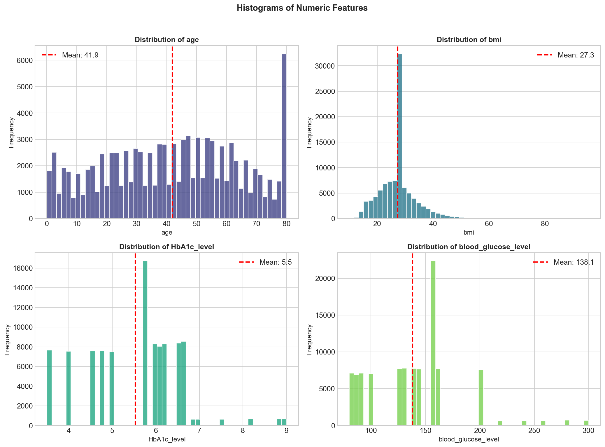
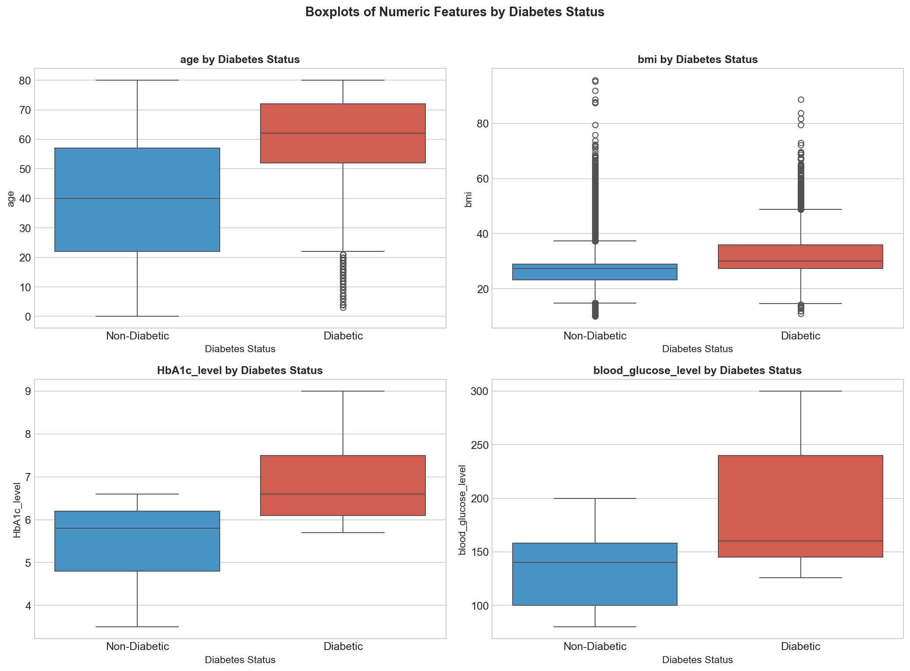
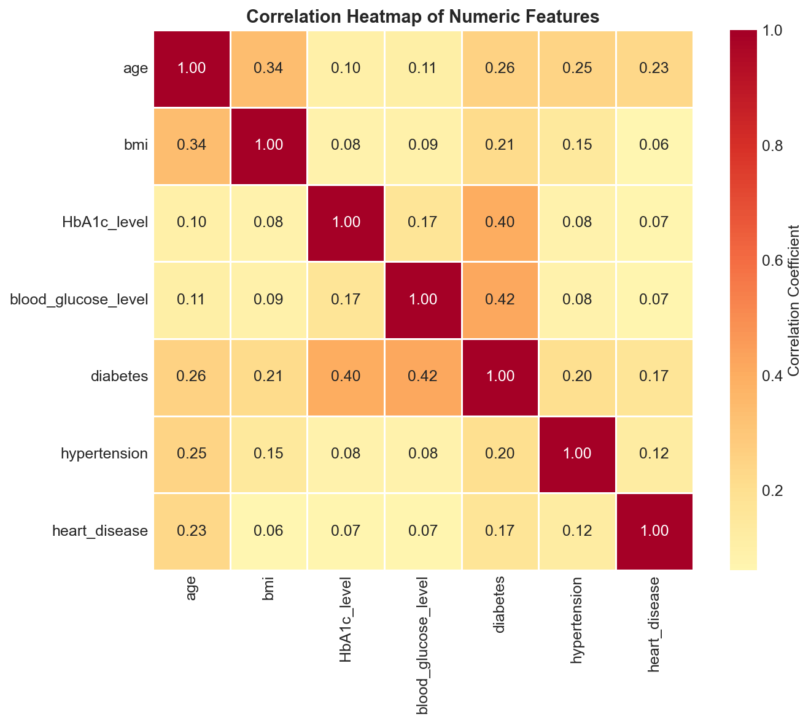
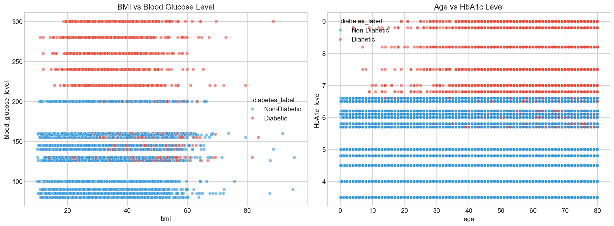
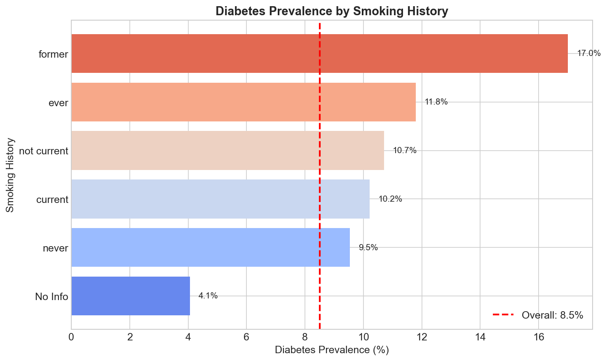
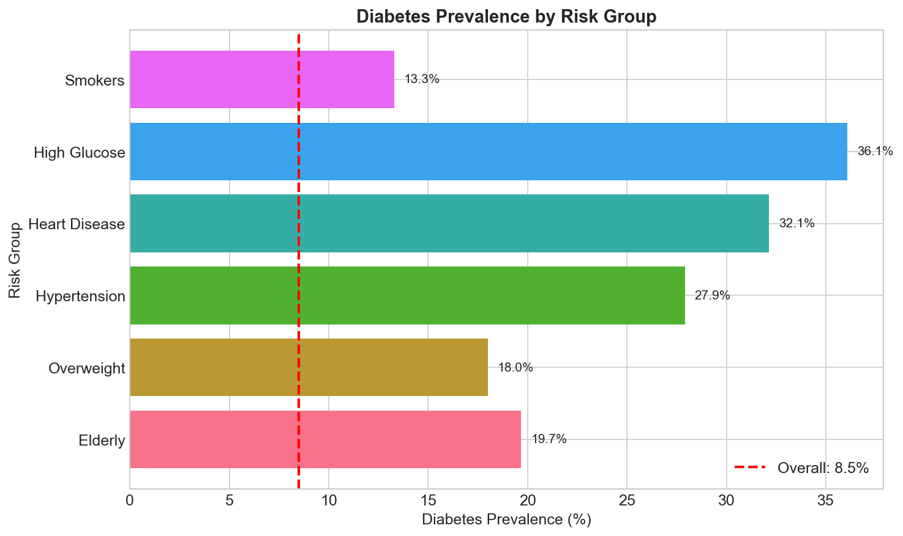

# Diabetes Prediction Dataset - Exploratory Data Analysis

This project performs a comprehensive Exploratory Data Analysis (EDA) on the Diabetes Prediction Dataset to understand the factors contributing to diabetes and to identify prevalence across different risk groups.

## Project Structure

```
├── analysis.ipynb          # Main Jupyter Notebook containing the EDA code
├── requirements.txt        # List of Python dependencies
├── data/                   # Directory to store the dataset
│   └── diabetes_prediction_dataset.csv
├── out/                    # Directory for generated outputs
    ├── plots/              # Visualizations (histograms, boxplots, scatter plots, etc.)
    └── tables/             # Summary statistics and processed data (JSON, CSV)
```

## Setup and Installation

1.  **Clone the repository** (if applicable) or navigate to the project directory.

2.  **Create a virtual environment (optional but recommended):**

    ```bash
    python3 -m venv venv
    source venv/bin/activate
    ```

3.  **Install dependencies:**
    ```bash
    pip install -r requirements.txt
    ```

## How to Run the Analysis

### Option 1: Jupyter Lab / Notebook

Open the notebook and run all cells interactively:

```bash
jupyter notebook analysis.ipynb
```

### Option 2: Command Line Execution

Execute the notebook and generate all outputs automatically without opening the UI:

```bash
jupyter nbconvert --to notebook --execute --inplace analysis.ipynb
```

## Outputs

The analysis generates the following outputs in the `out/` directory:

### Visual Analysis

#### 1. Feature Distributions



#### 2. Box Plots by Diabetes Status



#### 3. Correlation Heatmap



#### 4. Scatter Plots (BMI & Age)



#### 5. Smoking History & Diabetes



#### 6. Risk Group Prevalence



### Data Tables (`out/tables/`)

- `summary_statistics.csv`: Descriptive statistics of the dataset.
- `correlation.json`: Top correlations with diabetes.
- `risk_groups.csv`: Diabetes prevalence analysis for specific high-risk groups (e.g., High BMI, High Glucose, Elderly).

## Key Analysis Findings

Based on the exploratory data analysis, here are the key insights extracted from the dataset:

### 1. Summary Statistics

- **Total Patients:** 100,000
- **Diabetes Prevalence:** 8.5% of the dataset
- **Average Age:** 41.9 years
- **Average BMI:** 27.32

### 2. Top Correlated Features

The features most strongly correlated with diabetes are:

1.  **Blood Glucose Level:** 0.42 (Strongest predictor)
2.  **HbA1c Level:** 0.40
3.  **Age:** 0.26
4.  **BMI:** 0.21

### 3. Risk Group Analysis

Diabetes prevalence significantly increases in specific high-risk cohorts:

| Cohort            | Condition                | Diabetes Prevalence (%) |
| :---------------- | :----------------------- | :---------------------- |
| **High Glucose**  | Blood Glucose ≥ 180      | **36.08%**              |
| **Heart Disease** | History of Heart Disease | 32.14%                  |
| **Hypertension**  | History of Hypertension  | 27.90%                  |
| **Elderly**       | Age ≥ 60                 | 19.68%                  |
| **Overweight**    | BMI ≥ 30                 | 17.99%                  |
| **Smokers**       | Current/Former/Ever      | 13.29%                  |

## Dataset Source

[Kaggle - Diabetes Prediction Dataset](https://www.kaggle.com/datasets/iammustafatz/diabetes-prediction-dataset)
